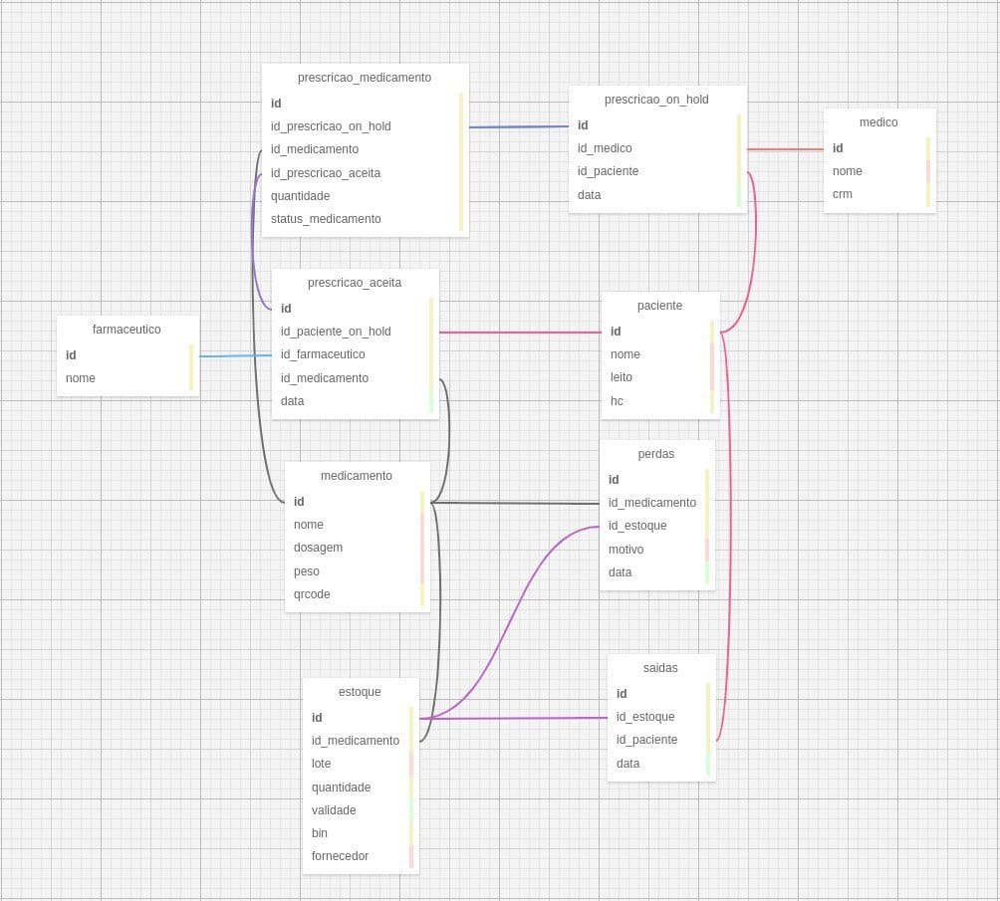

&nbsp;&nbsp;&nbsp;&nbsp;Um banco de dados é "uma coleção de dados inter-relacionados, representando informações sobre um domínio específico"[[1]](https://www.devmedia.com.br/conceitos-fundamentais-de-banco-de-dados/1649).

&nbsp;&nbsp;&nbsp;&nbsp;O banco de dados foi projetado para garantir um fluxo eficiente e seguro no gerenciamento de prescrições médicas, controle de estoque e administração de medicamentos aos pacientes. A estrutura relacional permite rastreamento completo de cada etapa do processo, desde a prescrição pelo médico até a saída do medicamento para o paciente, garantindo integridade e confiabilidade das informações, que é necessário quando se trata com trabalho médico.

&nbsp;&nbsp;&nbsp;&nbsp;O banco de dados é estruturado em torno de identificadores únicos que conectam prescrições, medicamentos, pacientes e profissionais envolvidos. A tabela prescricao_on_hold armazena solicitações médicas, vinculando um id_medico e um id_paciente a uma data específica. Já a prescricao_medicamento referencia tanto a prescrição em espera quanto a versão aceita, relacionando-se com id_medicamento e indicando quantidade e status. A prescricao_aceita, por sua vez, associa o id_paciente_on_hold a um id_farmaceutico e a um medicamento, registrando a data da aprovação. O controle de estoque se dá pela tabela estoque, que liga cada id_medicamento a um lote, validade e quantidade disponível. Saídas e perdas são rastreadas por tabelas específicas, garantindo a integridade do fluxo de medicamentos.

## Tabelas e Atributos

Esta seção detalha as tabelas, atributos e relações do banco de dados utilizado no sistema automatizado de medicamentos, desenvolvido para otimizar a eficiência operacional, segurança do paciente e integração com robôs manipuladores no ambiente hospitalar.

### 1. Tabela: `medico`

| Campo | Tipo de Dado | Descrição |
|-------|--------------|-----------|
| `id`  | Inteiro      | Identificador único do médico, gerado automaticamente. |
| `nome`| Texto        | Nome completo do médico. |
| `crm` | Texto        | Número do Conselho Regional de Medicina, único para cada médico. |

**Propósito:** Armazenar informações sobre os médicos que realizam as prescrições, facilitando identificação e rastreabilidade.

**Relações:** Relaciona-se com `prescricao_on_hold` através do atributo `id_medico`, pois toda prescrição feita por um médico precisa estar associada a um profissional responsável.

---

### 2. Tabela: `paciente`

| Campo | Tipo de Dado | Descrição |
|-------|--------------|-----------|
| `id`  | Inteiro      | Identificador único do paciente. |
| `hc`  | Texto        | Histórico Clínico, identificador único hospitalar. |
| `nome`| Texto        | Nome completo do paciente. |
| `leito`| Texto       | Identificação do leito do paciente (informação crítica). |

**Propósito:** Armazenar informações essenciais dos pacientes para garantir identificação correta durante todo o processo.

**Relações:** Relaciona-se com `prescricao_on_hold` e `prescricao_aceita`, pois toda prescrição deve estar vinculada a um paciente específico. Também se relaciona com `saidas`, garantindo que a dispensação do medicamento seja corretamente atribuída ao paciente correspondente.

---

### 3. Tabela: `farmaceutico`

| Campo | Tipo de Dado | Descrição |
|-------|--------------|-----------|
| `id`  | Inteiro      | Identificador único do farmacêutico. |
| `nome`| Texto        | Nome do farmacêutico responsável pela validação das prescrições. |

**Propósito:** Identificar o farmacêutico que validou cada prescrição, garantindo a responsabilidade e rastreabilidade.

**Relações:** Relaciona-se com `prescricao_aceita`, pois o farmacêutico precisa aprovar ou modificar as prescrições enviadas pelos médicos antes da separação dos medicamentos.

---

### 4. Tabela: `medicamento`

| Campo   | Tipo de Dado | Descrição |
|---------|--------------|-----------|
| `id`    | Inteiro      | Identificador único do medicamento. |
| `nome`  | Texto        | Nome comercial do medicamento. |
| `dosagem`| Texto       | Quantidade do princípio ativo. |
| `peso`  | Decimal      | Peso do medicamento (utilizado para validação pelo braço robótico Dobot). |

**Propósito:** Catalogar medicamentos disponíveis no sistema, com detalhes necessários para o processo automatizado e validação por peso.

**Relações:** Relaciona-se com `estoque`, pois os medicamentos precisam ser controlados em termos de quantidade e validade. Também se relaciona com `prescricao_medicamento`, garantindo que cada prescrição contenha os medicamentos corretos.

---

### 5. Tabela: `estoque`

| Campo         | Tipo de Dado | Descrição |
|---------------|--------------|-----------|
| `id`          | Inteiro      | Identificador único do registro no estoque. |
| `id_medicamento`| Inteiro    | Medicamento associado. |
| `lote`        | Texto        | Lote do medicamento (importante para rastreabilidade). |
| `quantidade`  | Inteiro      | Quantidade disponível. |
| `validade`    | Data         | Data de validade do medicamento (armazenado como texto, formato YYYY-MM-DD). |
| `bin`         | Texto        | Localização física no estoque. |
| `fornecedor`  | Texto        | Origem do medicamento (fornecedor). |

**Propósito:** Controlar estoque, rastrear validade e localização dos medicamentos, essencial para operação do robô.

**Relações:** Relaciona-se com `medicamento`, pois cada lote de medicamento precisa ser rastreado. Também se relaciona com `saidas`, garantindo que os medicamentos retirados do estoque sejam corretamente registrados. Além disso, se relaciona com `perdas`, para registrar descarte ou perdas de medicamentos.

---

### 6. Tabela: `prescricao_on_hold`

| Campo           | Tipo de Dado | Descrição |
|-----------------|--------------|-----------|
| `id`            | Inteiro      | Identificador da prescrição inicial (ainda não validada). |
| `id_medico`     | Inteiro      | Médico responsável. |
| `id_paciente`   | Inteiro      | Paciente associado. |
| `data_prescricao`| DataHora    | Data e horário da prescrição inicial. |

**Propósito:** Armazenar prescrições feitas pelos médicos, aguardando validação do farmacêutico.

**Relações:** Relaciona-se com `medico` e `paciente`, pois cada prescrição precisa estar vinculada a um profissional e a um paciente correspondente. Também se relaciona com `prescricao_aceita`, garantindo que a prescrição possa ser validada ou modificada pelo farmacêutico.

---

### 7. Tabela: `prescricao_aceita`

| Campo                 | Tipo de Dado | Descrição |
|-----------------------|--------------|-----------|
| `id`                  | Inteiro      | Identificador único da prescrição validada. |
| `id_prescricao_on_hold`| Inteiro     | Referência à prescrição original. |
| `id_farmaceutico`     | Inteiro      | Identificador do farmacêutico validador. |
| `data_validacao`      | DataHora     | Horário de validação. |

**Propósito:** Registrar a validação das prescrições pelo farmacêutico, com ou sem modificações.

**Relações:** Relaciona-se com `prescricao_on_hold`, pois cada prescrição aprovada precisa ter uma referência à original enviada pelo médico. Também se relaciona com `farmaceutico`, garantindo que haja um responsável por cada validação.

---

### 8. Tabela: `prescricao_medicamento`

| Campo                  | Tipo de Dado | Descrição |
|------------------------|--------------|-----------|
| `id`                   | Inteiro      | Identificador único. |
| `id_prescricao_on_hold`| Inteiro      |
 

&nbsp;&nbsp;&nbsp;&nbsp;O banco de dados contempla situações em que medicamentos podem ser descartados devido a danos ou vencimento. Esse controle é realizado pela tabela de perdas, que mantém um registro detalhado de cada descarte, vinculando a informação ao medicamento e ao estoque original. Esse processo permite auditorias e evita desperdícios indevidos.

&nbsp;&nbsp;&nbsp;&nbsp;A relação entre as tabelas é estabelecida por chaves estrangeiras, garantindo integridade referencial e permitindo que cada dado seja devidamente vinculado ao seu contexto. O design do banco de dados segue uma abordagem normalizada, reduzindo redundâncias e garantindo eficiência na recuperação e atualização das informações.

## Bibliografias
[[1]](https://www.devmedia.com.br/conceitos-fundamentais-de-banco-de-dados/1649)
