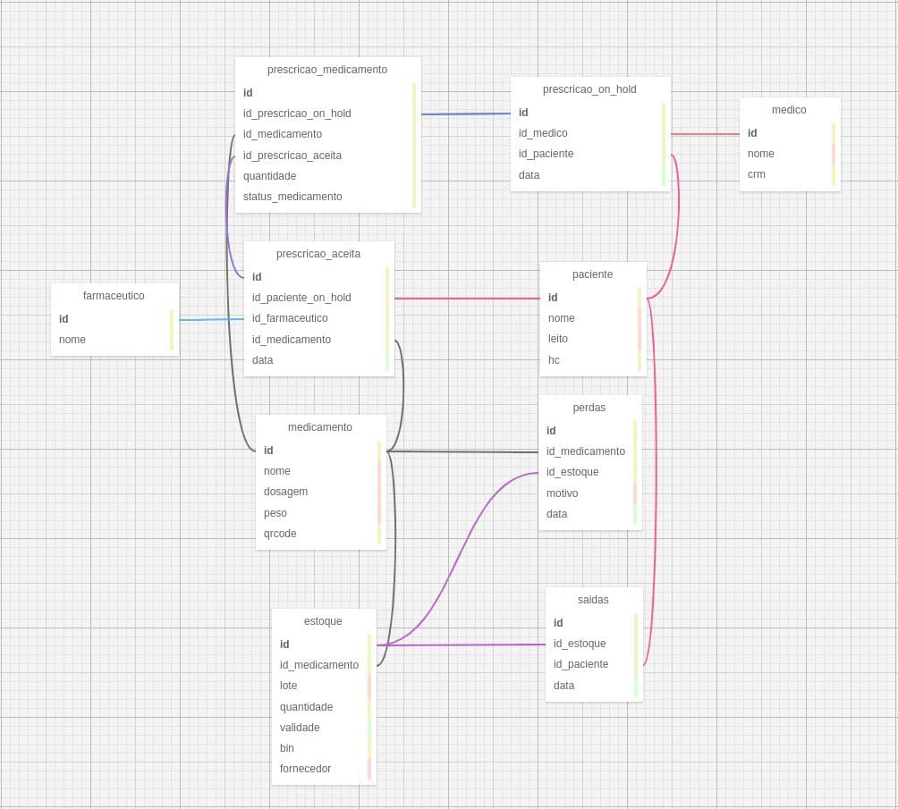
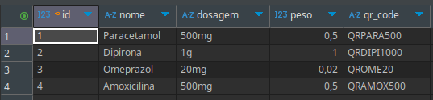
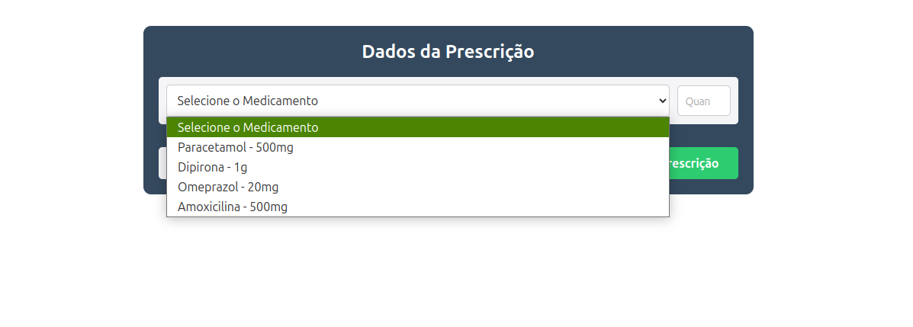

## Banco de dados
    
&nbsp;&nbsp;&nbsp;&nbsp;Este é o esquema do nosso banco de dados:


<div align="center">
<sub>Figura 1 - Banco de Dados</sub>


<sup>Fonte: Material produzido pelos autores (2025)</sup>
</div>

&nbsp;&nbsp;&nbsp;&nbsp;O banco de dados é mais aprofundando em outra seção da documentação.

## Operações CRUD

&nbsp;&nbsp;&nbsp;&nbsp;De acordo com Elmasri e Navathe em *Fundamentals of Database Systems*, "as operações de inserção, consulta, atualização e deleção são essenciais para a manipulação de dados, constituindo o núcleo funcional de um sistema de gerenciamento de banco de dados."

&nbsp;&nbsp;&nbsp;&nbsp;Baseado nestes principios que nós desenvolvemos o nosso banco de dados e operações CRUD: um acrônimo que representa as quatro operações básicas de manipulação de dados em um sistema de banco de dados.

- **Create (Criar):** Inserir novos registros.
- **Read (Ler):** Consultar e recuperar dados.
- **Update (Atualizar):** Modificar registros existentes.
- **Delete (Excluir):** Remover registros.

&nbsp;&nbsp;&nbsp;&nbsp;Para todas as tabelas no banco de dados foram implementadas as operações CRUD. Além disso, foi criada uma camada de lógica de aplicação, responsável por intermediar as requisições entre o frontend e o banco de dados. Essa camada inclui o tratamento de exceções, controle de sessões com o banco, padronização das respostas da API e execução de regras de negócio necessárias para o correto funcionamento da aplicação. Também foram utilizadas práticas como o carregamento eficiente de dados relacionados, garantindo performance e consistência nas respostas. 

A seguir, será possível ver o código `medicamentos_routes.py` e entender melhor como foi feito o CRUD, que mantém o mesmo padrão do código abaixo para as outras rotas.

```python
from flask import request, Blueprint
from fastapi import HTTPException
from ....database.db_conexao import engine, Base, get_db, SessionLocal
from ...models.medicamento import Medicamento

medicamento_routes = Blueprint('medicamento', __name__, url_prefix="/medicamento")

@medicamento_routes.route("/create", methods=["POST"])
def create_medicamento():
    data = request.json
    db = SessionLocal()
    try:
        medicamento = Medicamento(
            nome = data.get("nome"),
            dosagem = data.get("dosagem"),
            peso = data.get("peso"),
            qr_code = data.get("qr_code")
        )
        db.add(medicamento)
        db.commit()
        return {"message": "Novo medicamento salvo"}, 200
    except Exception as e:
        db.rollback()
        return {"error": str(e)}, 500
    finally:
        db.close()

@medicamento_routes.route("/delete", methods=["DELETE"])
def delete_medicamento():
    db = SessionLocal()
    try:
        medicamento_id = request.args.get("id")
        if not medicamento_id:
            raise HTTPException(status_code=400, detail="ID is required")

        medicamento_to_delete = db.query(Medicamento).filter(Medicamento.id == medicamento_id).first()
        if not medicamento_to_delete:
            raise HTTPException(status_code=404, detail=f"Medicamento com ID {medicamento_id} não encontrado")
        
        db.delete(medicamento_to_delete)
        db.commit()
        return {"message": f"medicamento com ID {medicamento_id} deletado do banco"}, 200
    except HTTPException as e:
        db.rollback()
        return {"error": e.detail}, e.status_code
    except Exception as e:
        db.rollback()
        return {"error": str(e)}, 500
    finally:
        db.close()

@medicamento_routes.route("/update", methods=["PUT"])
def update_medicamento():
    db = SessionLocal()
    try:
        data = request.json
        medicamento_id = data.get("id")
        if not medicamento_id:
            raise HTTPException(status_code=400, detail="ID is required")

        medicamento_to_update = db.query(Medicamento).filter(Medicamento.id == medicamento_id).first()
        if not medicamento_to_update:
            raise HTTPException(status_code=404, detail=f"Medicamento com ID {medicamento_id} não encontrado")

        medicamento_to_update.nome = data.get("nome", medicamento_to_update.nome)

        db.commit()
        return {"message": f"Medicamento de ID {medicamento_id} atualizado"}, 200
    except HTTPException as e:
        db.rollback()
        return {"error": e.detail}, e.status_code
    except Exception as e:
        db.rollback()
        return {"error": str(e)}, 500
    finally:
        db.close()

@medicamento_routes.route("/read-all", methods=["GET", "POST"])
def read_all_medicamento():
    db = SessionLocal()
    try:
        if request.method == "GET":
            medicamentos = db.query(Medicamento).all()
            
            if not medicamentos:
                return {"message": "No rows found"}, 200

            medicamentos = [{
                "id": medicamento.id,
                "nome": medicamento.nome,
                "dosagem": medicamento.dosagem,
            } for medicamento in medicamentos]
            
            return {"medicamentos": medicamentos}, 200

        elif request.method == "POST":
            data = request.json

            nome = data.get("nome")

            query = db.query(Medicamento)
            
            if nome:
                query = query.filter(Medicamento.nome == nome)
            
            medicamentos = query.all()
            
            if not medicamentos:
                return {"message": "No rows found with the provided filters"}, 200
            
            medicamentos = [{
                "id": medicamento.id,
                "nome": medicamento.nome,
                "dosagem": medicamento.dosagem,
                "peso": medicamento.peso,
                "qr_code": medicamento.qr_code                
            } for medicamento in medicamentos]
            
            return {"message": "Medicamentos Lido", "medicamentos": f"{medicamentos}"}, 200

    except HTTPException as e:
        return {"error": e.detail}, e.status_code
    except Exception as e:
        return {"error": str(e)}, 500
    finally:
        db.close()

@medicamento_routes.route("/read-id", methods=["POST"])
def read_medicamentos_id():
    db = SessionLocal()
    try:
        data = request.json
        medicamento_id = data.get("id")
        if not medicamento_id:
            raise HTTPException(status_code=400, detail="ID is required")
        
        medicamento = db.query(Medicamento).filter(Medicamento.id == medicamento_id).first()
        medicamento = {
            "id": medicamento.id,
                "nome": medicamento.nome,
                "dosagem": medicamento.dosagem,
                "peso": medicamento.peso,
                "qr_code": medicamento.qr_code             
        }
        
        if not medicamento:
            raise HTTPException(status_code=404, detail=f"medicamento com ID {medicamento} não encontrado")
        return {"message": "Medicamento Lido", "medicamento": f"{medicamento}"}, 200
    except Exception as e:
        db.rollback()
        return {"error": str(e)}, 500
    finally:
        db.close()
    
```

## Interface

&nbsp;&nbsp;&nbsp;&nbsp;Para a interface da aplicação foi usado React, uma biblioteca JavaScript para criação de interfaces de usuário, e para a estilização dos componentes foi utilizada a biblioteca styled-components, permitindo escrever estilos CSS diretamente dentro do JavaScript, com escopo local por componente.

&nbsp;&nbsp;&nbsp;&nbsp;Além disso, a página foi desenvolvida com TypeScript, garantindo segurança de tipos e melhor organização do código. Hooks como useState e useEffect são utilizados para controle de estado e efeitos colaterais.

&nbsp;&nbsp;&nbsp;&nbsp;A comunicação com o backend é feita por meio de requisições HTTP, consumindo uma API local que interage com o banco de dados para criar, consultar e alterar informações clínicas, como pacientes, medicamentos e prescrições médicas. A interface permite a seleção de medicamentos, a vinculação a pacientes, e o envio dessas informações de forma estruturada para o backend. Além disso, partes da aplicação se comunicam com um braço robótico (Dobot), também via API, permitindo capturar posições, controlar movimentos e configurar sequências associadas a medicamentos no sistema.

&nbsp;&nbsp;&nbsp;&nbsp; Na imagem abaixo, pode ser observado os medicamentos cadastrados no banco de dados:

<div align="center">
<sub>Figura 2 - Medicamentos cadastrados no banco de dados</sub>


<sup>Fonte: Material produzido pelos autores (2025)</sup>
</div>

&nbsp;&nbsp;&nbsp;&nbsp; Já na tela a seguir, fica claro ver a integração entre o front-end com o banco de dados, em que é exibido para o usuário os medicamentos cadastrados no banco de dados:

<div align="center">
<sub>Figura 3 - Tela de adicionar medicamento</sub>


<sup>Fonte: Material produzido pelos autores (2025)</sup>
</div>

## QR code
&nbsp;&nbsp;&nbsp;&nbsp;O hardware utilizado para leitura é um leitor de código serial, conectado diretamente à aplicação. Um dos maiores desafios foi garantir a comunicação estável entre o leitor e o sistema, considerando a diversidade de portas seriais e variações nos dispositivos. A conexão com o leitor é feita automaticamente através de uma varredura nas portas disponíveis. O sistema seleciona a porta correta, configura os parâmetros necessários e inicia o processo de escaneamento contínuo, pronto para detectar qualquer código QR posicionado frente ao leitor.

&nbsp;&nbsp;&nbsp;&nbsp;Cada leitura realizada é tratada por uma camada lógica que converte os dados brutos em informações estruturadas. Essas informações são então armazenadas em um banco de dados SQLite. Os registros incluem o conteúdo lido e um carimbo de tempo (timestamp) da leitura. Além da leitura, foram implementadas funcionalidades completas de CRUD sobre os registros escaneados. O usuário pode consultar os códigos já lidos, modificar informações associadas, excluir registros antigos ou inserir novos manualmente caso necessário.


