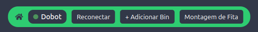
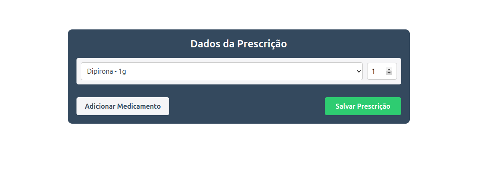

&nbsp;&nbsp;&nbsp;&nbsp;Na última Sprint de desenvolvimento, foram realizadas melhorias pontuais nas interfaces do sistema com base nos testes internos e no feedback do parceiro. As seções a seguir descrevem exclusivamente as **atualizações** realizadas após a entrega intermediária, sem repetir as funcionalidades já descritas anteriormente.

---

&nbsp;&nbsp;&nbsp;&nbsp;Uma das atualizações foi a inserção de um novo item na barra de navegação superior (Navbar): o botão "Montagem da Fita". Esse item possibilita que o usuário acesse diretamente a tela de montagem manual de fitas, anteriormente acessível apenas via rotas específicas. A alteração buscou facilitar o acesso à funcionalidade por parte dos farmacêuticos.

Figura 01 - Navbar com novo botão "Montagem da Fita"

Fonte: Material produzido pelos autores (2025)

---

&nbsp;&nbsp;&nbsp;&nbsp;Na tela de Adicionar Prescrição, foi implementada uma verificação para impedir que o campo de quantidade de medicamentos aceite valores negativos. Essa restrição foi adicionada para evitar inconsistências nos dados e falhas na montagem das fitas. Além disso, mensagens de erro foram integradas para orientar o usuário em caso de entrada inválida.

Figura 02 - Validação de Quantidade na Prescrição

Fonte: Material produzido pelos autores (2025)

---

&nbsp;&nbsp;&nbsp;&nbsp;No que diz respeito à tela de Dashboard, foi finalizada sua integração ao *back-end*. Assim, os dados apresentados passaram a ser dinâmicos, refletindo informações reais da base, como a taxa de sucesso do robô e o status atual das fitas montadas.

Figura 03 - Dashboard com dados integrados

Fonte: Material produzido pelos autores (2025)

---

&nbsp;&nbsp;&nbsp;&nbsp;A tela de Estoque foi integrada ao sistema, com envio e leitura de dados reais da base. Foi possível, então, permitir o controle completo do estoque de medicamentos, incluindo a visualização de medicamentos em falta, movimentações recentes (adições e retiradas) e uma visão geral por bin.

&nbsp;&nbsp;&nbsp;&nbsp;Por fim, a tela de Triagem recebeu importantes melhorias com base no feedback do parceiro hospitalar. Agora, não é mais possível adicionar medicamentos que não estejam na prescrição médica original. Também foi implementada a funcionalidade de "adiar medicamento", permitindo ao farmacêutico indicar que um item será separado mais tarde. Por fim, o ID do farmacêutico responsável pela triagem é coletado e registrado na base de dados.

Figura X - Triagem com novas restrições e função de adiamento

Fonte: Material produzido pelos autores (2025)

&emsp;&emsp; A seguir está um vídeo do sistema completo funcional e sua interação com o robô.

[Demonstração do Sistema Completo](https://youtu.be/0IkuhlxcgwE)

---

&nbsp;&nbsp;&nbsp;&nbsp;Com essas alterações, o sistema atinge um novo nível de robustez e usabilidade, atendendo de forma mais eficaz os fluxos reais de trabalho identificado junto ao Hospital das Clínicas da Unicamp.
